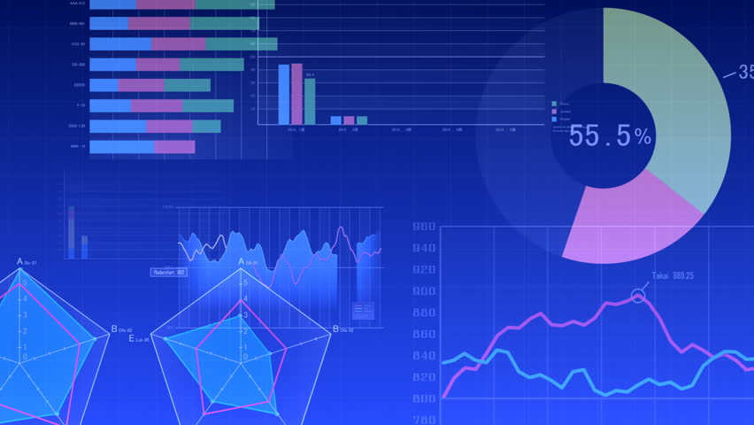
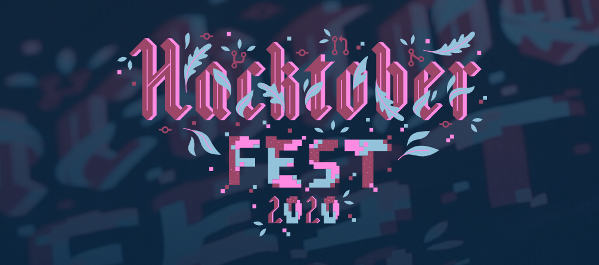

## Description
Ever missed a coding contest because you completely forget about it or misinterpret the timing, worked anonymous number of hours and still aren't able to convince your boss that you're working. 
Well we get it all covered for you.

  
  

We at hackStation provide a platform to share your work in number. Get your working graph
 reminders for coding contests and share your work among your peers. All you need to do is tell us who you are ? 
 The project will be divided into two parts depending upon whether a user is a developer or an organisation. A separate platform for developers as well as organisation.
  

## Skills Required
- Front-end
  - HTML, CSS, JavaScript
  - ReactJS
  - Graphjs / Amcharts.
- Backend
  - NodeJs
  - ExpressJs
  - JWT
  - WakaTime API
  - Oauth 2.0, passportJS
- Database
  - MongoDB
- With GraphQL API.
  

## What we do
At Hackstation 
- We track your number of hours of coding

- Remind you about various upcoming contests

<h2 align= "center"><b> Project Maintainer</b></h2>

<a href="https://github.com/ashishnagpal2498">
<h4 align="center"><b>Ashish Nagpal</b></a>
    

<h2 align= "center"><b> Open-Source</b></h2>

## Version 1.0
1. Homepage - Let us know who are user will be. For now we will be working on Developer side option of the web-app.
2. Profile page.
3. Latest - This will allow user to view various upcoming contests of various platforms.
4. User Authentication - Login/Signup.
5. Public profile view
6. Dashboard
  

## Features Implemented later
1. Organisation login- connecting employees with the superior authority.
2. Dashboard divided by teams
